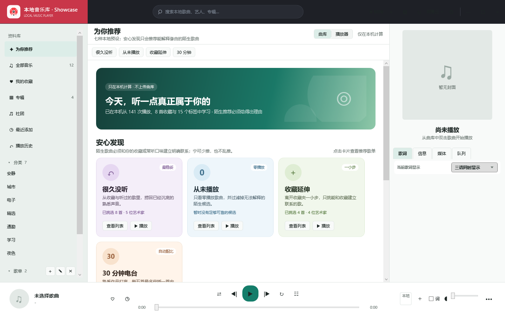
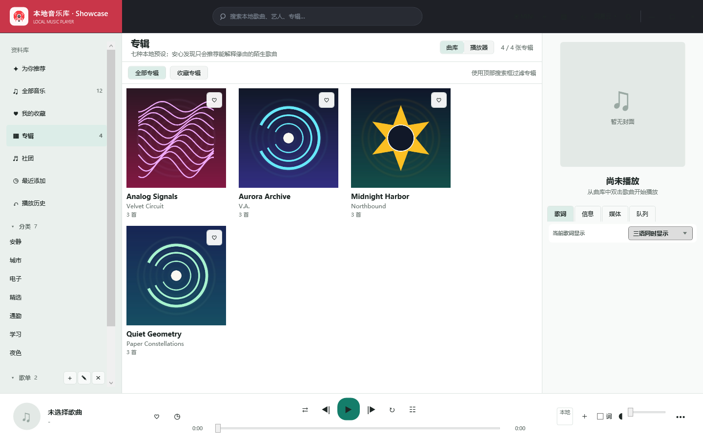
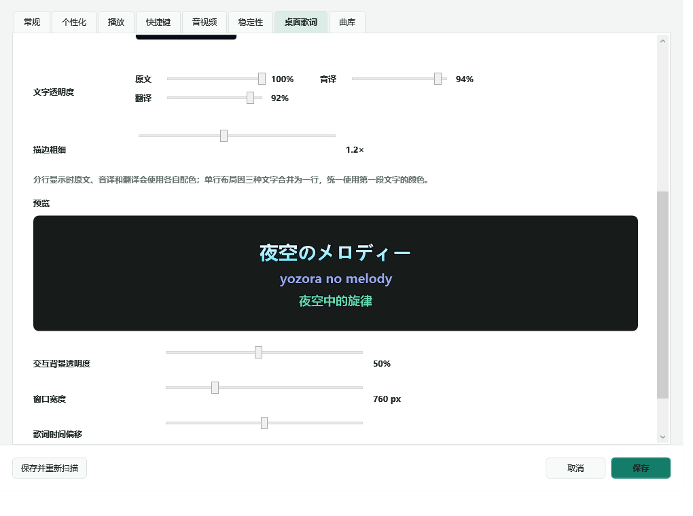

<p align="center">
  
</p>

# 本地音乐库 1.7.0 Preview 1 / OfflineMusicLibrary 1.7.0 Preview 1

[](https://github.com/Shist1145/OfflineMusicLibrary/actions/workflows/release.yml)
[](https://github.com/Shist1145/OfflineMusicLibrary/releases/latest)

**把音乐留在本地，把控制权还给你。**

OfflineMusicLibrary 是一款面向 Windows 本地曲库、NAS 与多语歌词的离线音乐播放器：以你的文件为准，不要求登录，不上传个人曲库。

<p align="center">
  <a href="https://github.com/Shist1145/OfflineMusicLibrary/releases/latest"><strong>下载最新版本</strong></a>
  ·
  <a href="https://github.com/Shist1145/OfflineMusicLibrary/issues">反馈问题</a>
</p>



### 为什么值得试

- **本地优先，也认真对待 NAS。** 网络目录断线时保留曲库、队列和播放位置；探测、缓存和恢复都有明确上限。
- **网易云歌单只负责映射。** 导入公开歌单与历史记录，严格区分原版和 Off Vocal，在本地做一对一匹配，不下载或替换你的音乐文件。
- **三轨歌词与细致样式。** 原文、音译、翻译可独立调色和调透明度，并支持描边颜色、描边粗细、桌面歌词与播放器内复用。

| 专辑与本地封面 | 三轨歌词样式 |
| --- | --- |
|  |  |

宣传截图统一使用浅色 **Mint / 薄荷青** 主题；Dark 主题另有自动对比度回归和[离屏可读性验收图](docs/images/dark-theme-controls-proof.png)，不再用坏掉的深色界面充当展示图。

OfflineMusicLibrary is a local-first Windows music manager and player for local files, NAS libraries, NetEase playlist mapping, and three-track lyrics. It requires no music-account login and does not upload your library.

> **1.7.0-preview.1 是 Windows x64 预览版。** 它在 1.6.3 稳定版之上加入 NAS Foundation、安全边界和新的稳定性保护；真实 NAS 休眠/唤醒、凭据失效、DAC 与 HDMI 功放仍需更多实机验收。已发布的 Linux/macOS 安装包仍是 [v1.4.0 跨平台预览版](https://github.com/Shist1145/OfflineMusicLibrary/releases/tag/v1.4.0)。

## 1.7.0-preview.1：NAS Foundation 与安全加固

本预览版按 [NAS 与家庭影院补强计划](docs/OfflineMusicLibrary-1.6.3_NAS家庭影院补强计划.md) 落地第一阶段，同时修复本轮安全审计发现的本地路径与资源耗尽风险。

- 每个本机、移动、UNC/SMB 或映射盘曲库根目录都有稳定 ID、类型、在线状态、延迟、最近在线时间和错误信息。
- 播放前与扫描入口不再在界面线程同步等待网络路径；NAS 离线会保留曲库、队列和播放位置，并按有上限的退避策略等待恢复。
- 完整播放会话会保存队列顺序、当前索引、位置、循环/随机模式和最近随机历史；关闭自动播放也不会丢掉原队列。
- 已读取的封面和歌词可以保存到本机容量受控缓存，NAS 离线时继续显示；清理缓存不会改写媒体文件或 NAS。
- NAS 播放可使用 5–30 秒缓冲，并同时配置 LibVLC 的文件、光盘与网络缓存。
- 缓存清理、统计和淘汰会跳过 junction/symlink/reparse point，并在删除前再次确认目标仍位于缓存根目录。
- 状态、歌词、封面、播放历史、缓存条目和网易云响应都有明确大小上限；超限内容在完整读入或解码前被拒绝，主状态超限时仍会继续尝试两级备份。
- NAS/文件探测使用有界并发和有界在途队列；同一路径复用同一探测任务，避免大量失联路径耗尽线程池。
- 曲库扫描不跟随目录或媒体文件的 reparse point；网易云模糊匹配按标题索引缩小候选，并限制单曲候选图规模，降低超大曲库导入的 CPU 峰值。
- GitHub Actions 改为最小权限、固定 action 提交、禁用持久化检出凭据，并使用可复现且拒绝链接逃逸的 Windows ZIP 脚本。

这些能力已经通过临时目录、稀疏超大文件、模拟 HTTP 响应和真实临时 junction 回归，但尚未把真实 NAS 休眠/唤醒、Wi-Fi 断线、Windows 凭据失效、DAC 与 HDMI 功放验收冒充为完成。详见 [CHANGELOG](CHANGELOG.md)、[安全审计报告](docs/SECURITY_AUDIT_1.7.0-preview.1.md) 和 [安全报告方式](SECURITY.md)。

## 1.6.3 解决了什么

这次热修复首先解决 1.6.2 状态保存变慢、连续操作与退出时容易表现为无响应的问题，同时完整保留大歌单导入和多代恢复能力。

- **状态保存恢复到接近 1.6.1 的速度。** 约 8.19 MB 的隔离副本从修复前 287–600 ms、约 36 MB 分配，降到约 31–48 ms、不到 0.21 MB 分配。
- **退出不再同步堵住界面。** 最终状态保存改为异步完成；即使前方已有保存或磁盘暂时较慢，窗口消息循环仍可响应。
- **状态文件自动瘦身。** 8 个纯界面显示字段不再为每首歌重复写入 JSON；旧状态可直接读取，下一次保存自动清理冗余内容。
- **三代恢复没有因提速而缩水。** 仍使用临时落盘、进程内锁、跨保存方文件锁、有效来源检查、复制长度检查和原子替换。
- **遗留临时文件会安全清理。** 启动时只删除超过一小时的旧状态临时文件，新鲜写入不会被碰触。
- **加入大状态性能门槛。** 6,000 首、至少 4 MiB 的回归样本会检查保存耗时、内存分配、备份轮换和临时文件清理。

1.6.2 引入的导入与数据安全修复继续保留：

- **大型网易云歌单不再轻易少歌。** 100 首歌曲详情整批返回空时，会自动拆成 25 首小批次重试；即使详情接口暂时不完整，也会保留完整歌曲 ID，等待下一次继续补全。
- **普通版与无人声版严格隔离。** `Off Vocal`、`Instrumental`、`伴奏`、`純音樂`、`無主唱`、`Backing Track`、日文オフボーカル等标记不会再被当作可以忽略的普通标题噪声。
- **不再由前面的模糊歌曲抢走后面的唯一文件。** 匹配改为全局一对一分配，并综合歌名、艺人、专辑、时长、可播放格式和已有云 ID。
- **会修正历史错误云 ID。** 如果过去把普通版 ID 记到了伴奏文件上，新导入会把错误关联移走并写入正确文件，导入报告会显示修正数量。
- **导入前曲库同步改为增量扫描。** 未变化文件直接复用已保存元数据；新文件和修改过的文件才读取标签、封面和歌词。老版本曲库会先补齐文件戳，而不是强迫 5,000 首歌曲全部重读一遍。
- **扫描可以取消。** 扫描时刷新按钮会变为取消按钮；已进入的单个 TagLib 同步读取需要等该次读取返回，但取消后不会保存半成品扫描结果。
- **阻止播放器双开。** 第二个实例会在创建播放引擎、热键和音频资源前退出，避免两个内存状态最后互相覆盖歌单、播放次数与设置。
- **状态备份真正保留上一代。** `backup` 不再是刚写完主文件的镜像，而是上一代有效状态；另有 `previous` 保存上上代。序列化、落盘、JSON 校验或替换失败会向调用方报告，不再悄悄显示成功。

完整变更见 [CHANGELOG.md](CHANGELOG.md)，网易云导入机制见 [docs/NETEASE_PLAYLIST_IMPORT.md](docs/NETEASE_PLAYLIST_IMPORT.md)，数据保护说明见 [docs/DATA_SAFETY.md](docs/DATA_SAFETY.md)。

## 主要能力

| 范围 | 能力 |
| --- | --- |
| 本地曲库 | 扫描 FLAC、MP3、M4A、OGG、OPUS、WAV、WMA、AAC、APE、NCM，以及常见本地视频格式；按歌曲、专辑、社团和分类整理 |
| 播放体验 | 标准、黑胶、沉浸歌词三种播放页；播放队列、随机模式、相似歌曲、迷你播放器、任务栏控制与全局热键 |
| 歌词 | 原文、音译、翻译三轨显示；桌面歌词；独立颜色、透明度、字号、描边颜色、描边比例和原文渐变 |
| 网易云迁移 | 导入公开歌单和离线导出的播放历史；优先匹配本地可播放文件，不下载歌曲，也不替代本地文件管理 |
| 音频 | EQ 预设、空间效果、播放速度、音频后端、硬件解码、视频输出和缓存配置 |
| 稳定性 | 安全播放模式、播放停滞看门狗、有限次数自动恢复、单实例保护、增量扫描与多代状态恢复 |
| 隐私 | 不要求账号登录；状态默认仅写入 `%LOCALAPPDATA%\OfflineMusicLibrary`；媒体文件保持在用户指定目录 |

### 关于 NCM

应用可以索引 `.ncm` 文件并在匹配时保留其身份，但会优先选择同曲目的普通可播放文件。OfflineMusicLibrary 不承诺解密受保护的 NCM 内容，也不会从网易云下载缺失歌曲。

## 网易云歌单导入

在主界面选择“网易云 → 导入歌单”，粘贴公开歌单链接或纯数字歌单 ID。导入流程会：

1. 快速同步本地音乐文件夹，把新增歌曲加入索引。
2. 读取歌单声明数量、完整歌曲 ID 和可取得的歌曲详情。
3. 对临时失败的歌曲详情进行重试，并保留仍未解析的 ID。
4. 先锁定可信云 ID，再进行全局一对一本地匹配。
5. 只有远端 ID 与歌曲详情足够完整时，才允许清理旧歌单中已确认消失的内容。

“网易云有 700 首但本地只导入 554 首”并不总是同一个原因。1.6.2 修复了批次空响应和错误抢占造成的少导入；剩余未匹配项通常属于本地确实缺少文件、标题/艺人信息不足、同一文件对应多个网易云版本，或远端详情暂时没有返回。完成窗口会把这些情况分开统计。

## 歌词与播放页面

- 原文、音译、翻译可独立设置颜色与透明度。
- 描边颜色和描边比例可单独调整，不再只能跟随主文字颜色。
- 支持原文、音译、翻译的单轨、双轨和三轨组合。
- 桌面歌词与沉浸播放页使用同一套样式规则，并兼容旧版配置。
- 播放页支持标准、黑胶和歌词布局；返回曲库时会恢复正常导航状态。
- 同名 `.lrc` 可识别同时间轴内的音译/翻译，也支持 `.zh.lrc`、`.cn.lrc`、`.trans.lrc`、`.translated.lrc` 和 `.tlrc` 翻译旁路文件。

## 下载与安装

1. 打开 [GitHub Releases](https://github.com/Shist1145/OfflineMusicLibrary/releases)。
2. 下载 `OfflineMusicLibrary-1.7.0-preview.1-windows-x64.zip`，并可用同一 Release 中的 `SHA256SUMS-1.7.0-preview.1.txt` 核对完整性。
3. 完整解压到一个可写目录，不要直接在压缩包内运行。
4. 运行 `OfflineMusicLibrary.exe`。

Windows 包是自包含 x64 版本，不要求另行安装 .NET。LibVLC 运行库和插件必须与 `OfflineMusicLibrary.exe` 保持在同一个解压目录中。

### 从旧版本更新

- 退出旧版后，解压 1.7.0-preview.1 到新的程序目录。
- 不需要复制 `%LOCALAPPDATA%\OfflineMusicLibrary`；新版本会继续读取原状态。
- 建议保留旧程序目录几天，确认新版本正常后再手动删除。
- 不要删除 `library-v2.json` 来解决界面问题；先查看日志和备份，必要时按 [数据恢复说明](docs/DATA_SAFETY.md) 操作。

## 数据保存与恢复

Windows 完整版默认使用：

```text
%LOCALAPPDATA%\OfflineMusicLibrary\
├─ library-v2.json           最新有效状态
├─ library-v2.backup.json    上一代有效状态
├─ library-v2.previous.json  上上代有效状态
├─ library-v2.write.lock     跨保存方写入锁
├─ playlist-artwork\         自定义歌单封面
├─ asset-cache\              容量受控的本机歌词/封面缓存
└─ logs\                     诊断日志
```

扫描不会把暂时离线的移动硬盘或无法访问的子目录直接当作“歌曲已删除”。只有已确认可访问的目录中确实不存在的文件，才会从本次索引中移除。取消扫描、枚举失败或元数据读取异常不会授权写入一个半成品空曲库。

## 从源码构建

Windows 完整版需要 .NET 10 SDK 和 Windows x64：

```powershell
dotnet restore src/OfflineMusicLibrary/OfflineMusicLibrary.csproj
dotnet build src/OfflineMusicLibrary/OfflineMusicLibrary.csproj -c Release --no-restore

$projects = Get-ChildItem tests -Recurse -Filter *.csproj | Sort-Object FullName
foreach ($project in $projects) {
    dotnet run --project $project.FullName -c Release
    if ($LASTEXITCODE -ne 0) { exit $LASTEXITCODE }
}

dotnet publish src/OfflineMusicLibrary/OfflineMusicLibrary.csproj `
    -c Release -r win-x64 --self-contained true `
    -p:DebugType=None -p:DebugSymbols=false `
    -o artifacts/windows

py -3 packaging/create_windows_archive.py `
    --source artifacts/windows `
    --output artifacts/OfflineMusicLibrary-1.7.0-preview.1-windows-x64.zip
```

跨平台预览源码可以单独构建：

```powershell
dotnet build CrossPlatform/OfflineMusicLibrary.CrossPlatform.csproj -c Release
```

确定性回归检查使用临时目录和模拟网易云响应，不读取或改写个人曲库，也不要求真实网络。测试覆盖：

- 专辑身份与社团整理
- 增量扫描、离线根目录保留、修改文件刷新与取消
- 扫描与缓存跳过 junction/symlink/reparse point，且缓存删除不越过根目录
- 三轨歌词解析与样式
- 迷你播放器和播放页状态
- Windows 与跨平台网易云 700 首批次重试、Off Vocal 隔离和全局匹配
- 歌单安全同步与维护
- 推荐和播放历史导入
- 单实例、播放恢复、状态轮换、损坏恢复、保存失败传播和 6,000 首大状态性能门槛
- 状态、歌词、封面、播放历史、缓存和 HTTP 响应的超限拒绝，以及 NAS 探测并发/队列上限

## 仓库结构

```text
src/OfflineMusicLibrary/     Windows WPF 完整版
CrossPlatform/               Avalonia 跨平台预览源码
tests/                       无个人数据的确定性回归检查
tools/                       可选的状态加载/保存基准工具
docs/                        导入与数据安全说明
packaging/                   Windows 可复现 ZIP 与 Linux/macOS 预览版打包资料
.github/workflows/           构建、测试、发布和 SHA-256 工作流
```

## 当前边界

- 这是本地播放器与迁移工具，不是网易云客户端，也不提供在线流媒体播放或歌曲下载。
- 网易云公开接口可能临时限流或不返回部分详情；1.7.0-preview.1 会保留 ID 和旧歌单内容，但无法凭空补出本地没有的媒体文件。
- Linux/macOS 已发布包仍是 1.4.0 预览版，缺少部分 Windows 播放页、桌面集成、歌词样式和稳定性设置。
- 本预览版尚未完成真实 NAS、Windows 凭据过期、USB DAC、HDMI 功放和多声道设备的全面实机验收；稳定版仍为 v1.6.3。
- 自动测试可以证明匹配、保存和状态迁移规则，但不能替代所有显卡、音频设备和桌面环境上的人工播放验收。

## 反馈问题

请在 [GitHub Issues](https://github.com/Shist1145/OfflineMusicLibrary/issues) 中说明：

- 应用版本和 Windows 版本
- 问题发生前执行的操作
- 是否使用移动硬盘、NCM、视频或特殊音频后端
- 导入报告中的声明数量、详情数量、匹配数量和未匹配数量
- 对应时间段的诊断日志

请不要上传完整 `library-v2.json`、真实媒体文件、私人歌单链接或包含个人路径的未经处理日志。
